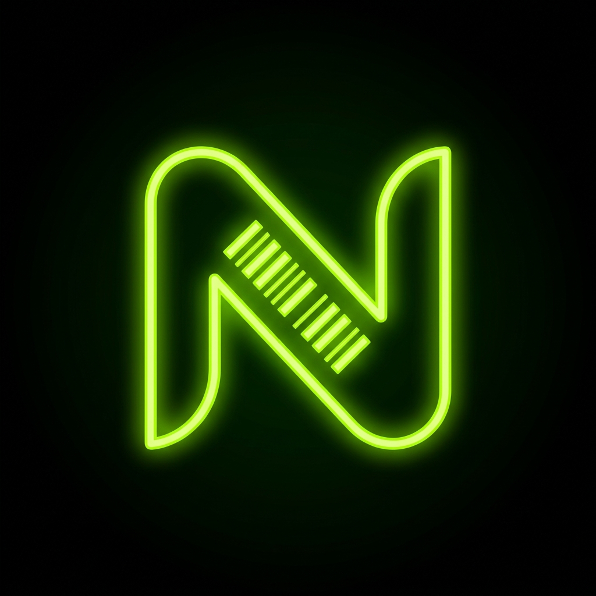

  
  <h1 align="center">NeonPOS</h1>
  
<strong>Sistema de Punto de Venta (POS) en la nube, seguro y de alto rendimiento.</strong>

---

## 📌 Resumen del Proyecto

**NeonPOS** es una aplicación de Punto de Venta moderna, diseñada para responder de manera ágil en comercios, bares o tiendas que requieren velocidad comercial y un seguimiento impecable de ingresos e inventarios. 

El proyecto fue construido bajo la premisa **"Production-Ready"**, priorizando una arquitectura *Zero-Trust*, diseño estético premium (Dark Mode con acentos verde Neón `#9EFF00`) y estabilidad transaccional; asegurándose de que tanto el cálculo de cajas como el cruce de stock se maneje estrictamente del lado del servidor para evitar vulnerabilidades de inyección u ordenamiento por red.

## 🚀 Funcionalidades y Flujos Implementados

- **Terminal de Ventas Transaccional**: UI optimizada para captura de caja con validación transaccional rígida, imposibilitando cobros con cajas cerradas o cálculos de existencias negativas.
- **Gestión Avanzada de Inventario**: Administración de categorías y productos con políticas reactivas.
- **Monitoreo de Cajas Registradoras**: Control aislado (*Multi-tenant*) que garantiza que cada operario mantiene un recuento lógico e íntegro entre entradas y salidas.
- **Seguridad a Nivel de Fila (RLS)**: Encriptación de datos y políticas en base de datos que dictan acceso perimetral. Ni siquiera el cliente frontend puede forzar alteraciones no autorizadas.
- **Resiliencia en Diseño (UX/UI)**: Uso extendido de carga optimista (*useTransition*), y Skeleton Loaders para tiempos de repuesta percibidos como instantáneos.

---

## 🛠️ Stack Tecnológico (Tecnologías Clave)

### Frontend & UX
- **[Next.js (App Router) v15+](https://nextjs.org/)**: Framework principal con renderizado del lado del servidor (SSR) para SEO excepcional y seguridad anti-XSS.
- **[React 19](https://react.dev/)**: Componentes interactivos modulares.
- **[Tailwind CSS](https://tailwindcss.com/)**: Motor de estilos por utilidad, definiendo una paleta estricta sin CSS masivo obsoleto.
- **[Zustand](https://github.com/pmndrs/zustand)**: Gestión de estado global asíncrono y ligero en cliente (ideal para mantener estados del carrito y pestañas de órdenes por separado).
- **[React Hook Form](https://react-hook-form.com/) & [Zod](https://zod.dev/)**: Validación unánime y tipada en todos los formularios interactivos, replicando la barrera hacia el lado del servidor.

### Backend y Base de Datos
- **[Next.js Server Actions](https://nextjs.org/docs/app/building-your-application/data-fetching/server-actions-and-mutations)**: Mutación directa a nivel servidor evitando las convenciones expuestas de APIs REST (Mitiga CSRF automáticamente).
- **[Supabase](https://supabase.com/)**: Backend as a Service y provedor líder en la nube.
- **[PostgreSQL](https://www.postgresql.org/)**: Motor de la base de datos transaccional estricta, reforzado con SQL Triggers automatizados de control (ej. descuento automático de inventario físico).
- **[Supabase Auth (SSR Cookies)](https://supabase.com/docs/guides/auth/server-side/nextjs)**: Autenticación con *Secure HttpOnly cookies*, previniendo compromisos ante accesos a *localStorage*.

### Aseguramiento de Calidad (QA) y Testing
- **[Vitest](https://vitest.dev/)**: Cobertura estática matemática y para validación veloz del DOM (Testing Library).
- **[Playwright](https://playwright.dev/)**: Sandbox dinámico para la emulación E2E de flujos de venta en un navegador agnóstico a hardware.
- **Seguridad Perimetral**: Políticas exhaustivas RLS, encabezados prevenidos (`X-Frame-Options`, `X-Content-Type-Options`) mitigando clickjacking e inyección a nivel proxy y balanceador.

---

## 💡 Criterios de Calidad

El proyecto fue depurado desde su fase de pre-producción eliminando dependencias circulares, asegurando directivas `use client` vs `use server` de forma precisa, y resolviendo cualquier fallo subyacente de "Hydration Mismatch" producido por navegadores de terceros, cerrando un anillo integral listo para su despliegue comercial (ej. Vercel u hospedajes autónomos).
